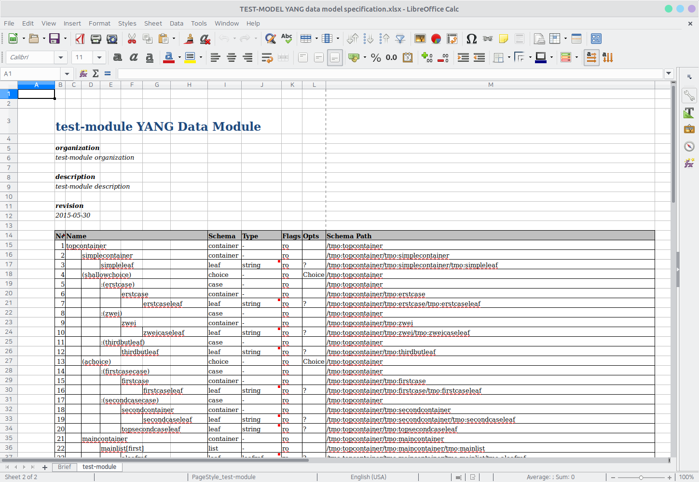

# pyangexcel (pyang excel plugin)

This is a pyang excel output plugin. It takes YANG files and tries to produce a Excel Schema file for readability.

## Installation and execution

```bash
# Install
python setup.py install --user --record install-list.txt

export PYANG_PLUGINPATH=`/usr/bin/env python -c \
'import pyangexcel; import os; print ("{}".format(os.path.dirname(pyangexcel.__file__)))'`
pyang -f excel --excel-model-name=TEST-MODEL --excel-model-ver=1.0 --excel-model-author=neoul@ymail.com --path=test test/test-module.yang

# Remove
xargs rm -rf < install-list.txt
```

## Result


